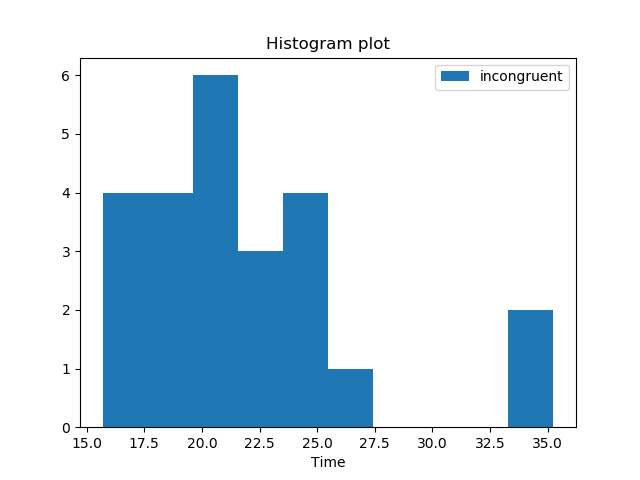

# Test A Perceptual Phenomenon - Stroop Effect
### by Shuyu Wang
*Apr 2017*

## Background Information
In a Stroop task, participants are presented with a list of words, with each word displayed in a color of ink. The participant’s task is to say out loud the color of the ink in which the word is printed. The task has two conditions: a congruent words condition, and an incongruent words condition. In the congruent words condition, the words being displayed are color words whose names match the colors in which they are printed: for example <span style="color:red">RED</span>, <span style="color:blue">BLUE</span>. In the incongruent words condition, the words displayed are color words whose names do not match the colors in which they are printed: for example <span style="color: red">PURPLE</span>, <span style="color: green">ORANGE</span>. In each case, we measure the time it takes to name the ink colors in equally-sized lists. Each participant will go through and record a time from each condition.

## Questions For Investigation
1. What is the independent variable? What is the dependent variable?
2. What is an appropriate set of hypotheses for this task? What kind of statistical test do you expect to perform? Justify your choices.
3. Report some descriptive statistics regarding this dataset. Include at least one measure of central tendency and at least one measure of variability.
4. Provide one or two visualizations that show the distribution of the sample data. Write one or two sentences noting what you observe about the plot or plots.
5. Now, perform the statistical test and report your results. What is your confidence level and your critical statistic value? Do you reject the null hypothesis or fail to reject it? Come to a conclusion in terms of the experiment task. Did the results match up with your expectations?
6. Optional: What do you think is responsible for the effects observed? Can you think of an alternative or similar task that would result in a similar effect? Some research about the problem will be helpful for thinking about these two questions!

## Answers to those questions
1. What is the independent variable? What is the dependent variable?
    - The independent variable here in this case is the way the text displayed, which is whether the text is 'Congruent' or 'Incongruent'.
    - The dependent variable here is the time each person need to read the text.
2. What is an appropriate set of hypotheses for this task? What kind of statistical test do you expect to perform? Justify your choices.
    - Our null hypothesis(H<sub>0</sub>) here is the average time people spend on congruent words are not significantly longer than the time on incongruent group of words. The alternative hypothesis(H<sub>1</sub>) is the time spend on incongruent group of words are significantly longer than it on congruent words.
    - Here we use &mu;<sub>0</sub> to denote the mean time for congruent group and &mu;<sub>1</sub> to denote the mean time for incongruent group
    - Hypotheses tests:
        H<sub>0</sub>: &mu;<sub>0</sub> = &mu;<sub>1</sub>
        H<sub>A</sub>: &mu;<sub>0</sub> < &mu;<sub>1</sub>
    - Kind of statistical test:
        Single tail paired t-test
    - Reason and Assumption: 
        - The dependent variable, which is time spent on each group, is continuous
        - The observations are independent since they are different individuals in front their computers
        - The dependent variable is approximately normally distributed
        - There are two data points in the incongruent group which are a little away from others, but they are not very far away, so we can consider that they are not outliers.
        - The sample size is small enough to use a t-test(less than 30). The time is the same group of people who took two diffrent setting of one same experiment, so it's a paired test. Single tail is because we are expecting that the incongruent set take people more time to read.
    - Following is the detail of the data set
    
3. Report some descriptive statistics regarding this dataset. Include at least one measure of central tendency and at least one measure of variability.
        
        | Congruent | Incongruent |
        |-----------|-------------|
        | 12.079    | 19.278      |
        | 16.791    | 18.741      |
        | 9.564     | 21.214      |
        | 8.630     | 15.687      |
        | 14.669    | 22.803      |
        | 12.238    | 20.878      |
        | 14.692    | 24.572      |
        | 8.987     | 17.394      |
        | 9.401     | 20.762      |
        | 14.480    | 26.282      |
        | 22.328    | 24.524      |
        | 15.298    | 18.644      |
        | 15.073    | 17.510      |
        | 16.929    | 20.330      |
        | 18.200    | 35.255      |
        | 12.130    | 22.158      |
        | 18.495    | 25.139      |
        | 10.639    | 20.429      |
        | 11.344    | 17.425      |
        | 12.369    | 34.288      |
        | 12.944    | 23.894      |
        | 14.233    | 17.960      |
        | 19.710    | 22.058      |
        | 16.004    | 21.157      |


    From the data above, we have the following statistics:

    * Sample size = 24
    * Measure of Central Tendency
        - Mean: &mu;<sub>0</sub> = 14.05 &nbsp; &mu;<sub>1</sub> = 22.02
        - Median: median<sub>0</sub> = 14.3565 &nbsp; median<sub>1</sub> = 21.0175
    * Measure of Variability
        - Standard Deviation: Std<sub>0</sub> = 3.56 &nbsp; Std<sub>1</sub> = 4.80

4. Provide one or two visualizations that show the distribution of the sample data. Write one or two sentences noting what you observe about the plot or plots.

    ```python
    import pandas as pd
    import matplotlib.pyplot as plt

    data = pd.read_csv('stroopdata.csv')

    plt.title('Scatter plot')
    plt.scatter(x=range(data.shape[0]), y = data.iloc[:, 0], label = 'congruent')
    plt.scatter(x=range(data.shape[0]), y = data.iloc[:, 1], label = 'incongruent')

    plt.legend()
    plt.show()

    plt.style.use('ggplot')
    plt.boxplot([data.iloc[:, 0], data.iloc[:, 1]])
    plt.grid(linestyle='-', linewidth=2)
    plt.title('Boxplot')
    plt.xticks([1, 2], ['congruent', 'incongruent'])
    plt.show()
    ```
    
    
    From the histogram above, we can see the shape of the congruent group of words. They are not exactly but approximately normal distributed.

    
    From the histogram above, we can see the shape of the incongruent group of words. They are not exactly but approximately normal distributed. There are two points are little away from the others but not too far. I think it's safe to consider them as normal data points instead of outliers.

    
    From the scatter plot we can see how the data points distribute.Most points of the incongruent group are above the congruent group. However, there's a overlap between the points, some of the points are mixed in the other group.
    
    From the boxplot we can see that there are indeed a overlap between the two group, but there's a very obvious difference between the mean values of each group.

5. Now, perform the statistical test and report your results. What is your confidence level and your critical statistic value? Do you reject the null hypothesis or fail to reject it? Come to a conclusion in terms of the experiment task. Did the results match up with your expectations?


    ```python
    from scipy import stats
    import pandas as pd

    data = pd.read_csv('stroopdata.csv')
    congruent = data['Congruent']
    incongruent = data['Incongruent']


    t_value, p_value = stats.ttest_rel(congruent, incongruent)
    print(stats.ttest_rel(congruent, incongruent))

    print('The t_value for this experiment is {}'.format(t_value))
    print('The p_value for this experiment is {}'.format(p_value))
    ```

    ```python
        Ttest_relResult(statistic=-8.020706944109957, pvalue=4.103000585711178e-08)
        The t_value for this experiment is -8.020706944109957
        The p_value for this experiment is 4.103000585711178e-08
    ```
    

    Above is the python code for t-test and the result from that code. Following is the alternative R code for t-test just for reference.

    ```r
        data <- read.csv('stroopdata.csv')
        library(dplyr)

        t.test(x=data$Congruent, \
            y=data$Incongruent, \
            alternative='two.sided', \
            mu=0, \
            paired=TRUE, \
            conf.level=0.95)
    ```

    ```r

            Paired t-test

        data:  data$Congruent and data$Incongruent
        t = -8.0207, df = 23, p-value = 4.103e-08
        alternative hypothesis: true difference in means is not equal to 0
        95 percent confidence interval:
         -10.019028  -5.910555
        sample estimates:
        mean of the differences 
                      -7.964792 

    ```

    Now we have the p-value less than 0.05, then we can reject the null hypothesis and say that the time difference between congruent and incongruent is statistically significant. The p-value means that out of 100 times we repeat this experiment, the probability of this difference happened by chance is less than 0.00000004103. That gives us that the stroop effect is real.

    From the confidence interval, we have 95% confidence for the true difference between the congruence and incongruence group average times is between -10 and -5.9.


6. Optional: What do you think is responsible for the effects observed? Can you think of an alternative or similar task that would result in a similar effect? Some research about the problem will be helpful for thinking about these two questions!
    * I think that during the time we learn things from text, we have grown an ability that we decode words very instant and those words to us are not words any more. They are more like a straight concept that we don't need to think about it. However, when we need to think about the color rather than the meaning of the words, the process I described above will put the brain in trouble.
    There's a very similar game like this: I ask you how much is 2 plus 3, but show you 4 fingers, people will say 4 instead of 5 since people tend to get the visual information faster than thinking about a math calculation.


Reference:

https://en.wikipedia.org/wiki/Stroop_effect

https://en.wikipedia.org/wiki/Student%27s_t-test

http://blog.minitab.com/blog/adventures-in-statistics-2/understanding-t-tests%3A-1-sample%2C-2-sample%2C-and-paired-t-tests

http://www.statisticshowto.com/probability-and-statistics/t-test/

https://www.statisticssolutions.com/manova-analysis-paired-sample-t-test/